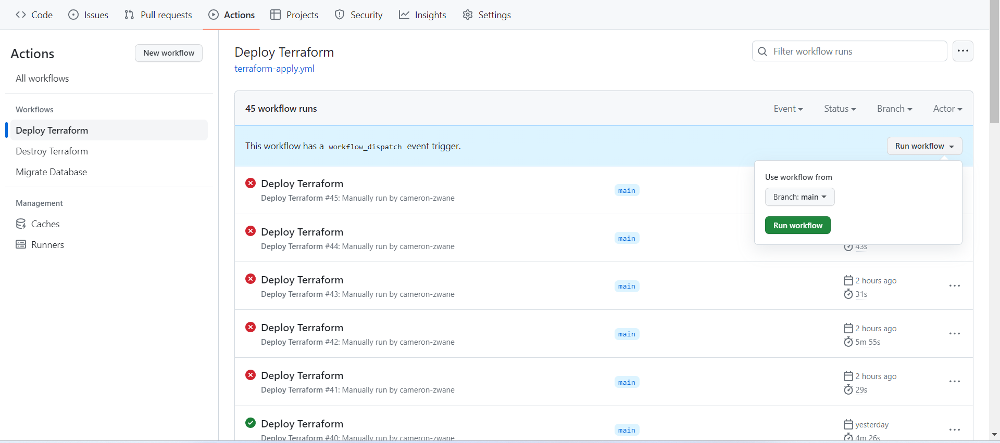
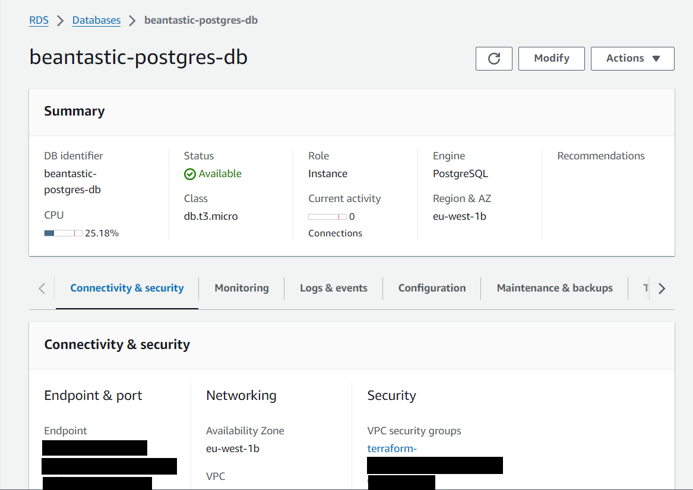

# Bean-Tastic-DB
Database Source Code for BeanTastic Adventure Game.

## Technologies Used
- Git and GitHub: Source control
- Flyway: Database migration tool
- GitHub Actions: CI/CD pipeline
- AWS RDS: Relational Database Service - Postgres
- Terraform: Infrastructure as Code (IaC) tool
- AWS S3 Bucket: A Bucket used for storing the Terraform State

## Setting Up The Infrastructure

### S3 State Bucket

The S3 bucket is there to keep Terraform state. This is to make sure that when the
GitHub Actions Deployment workflow runs (which uses Terraform to create and manage
the AWS resources) smoothly.

#### GitHub Secrets

Visit [GitHub Secrets](https://docs.github.com/en/actions/security-guides/using-secrets-in-github-actions)
for instructions on how to set GitHub secrets.

Create the bucket on AWS. While this can be a step in the GitHub Workflow, you
will encounter something called the chicken-egg problem of Terraform. To make things
simple, [create the bucket](https://docs.github.com/en/actions/security-guides/using-secrets-in-github-actions) using the official AWS documentation.

Now there is a state management.

#### Errors related to the S3 Bucket

```
Error: Failed to get existing workspaces: S3 bucket "***" does not exist.
```

This error is an indication that the state bucket has not been created or that the
Terraform is referring to a different bucket than what was created in the previous
section.

Check that the Terraform is referring to the correct bucket in the `main.tf` file:

```terraform
terraform {
  required_providers {
    aws = {
      source = "hashicorp/aws"
      version = "~> 5.40.0"
    }
  }

  required_version = ">= 1.7.4"

  backend "s3" {
    bucket = "beantastic-state-bucket"
    key = "infrastructure/state-files" <--- This here
    region = "eu-west-1"
  }
}
```


### Setting up the Secrets Needed to Run a Deployment

#### - GitHub Secrets

GitHub secrets are used to hide the sensitive data like the Arn role and 
db passwords. This repo needs a few secrets:

- AWS_ROLE
- AWS_REGION
- AWS_RDS_ENDPOINT
- DB_USERNAME
- DB_PASSWORD
- DB_PORT

##### - Arn Role

To be able to apply any of the Terraform, privileges to connect to AWS is needed.
This is where an Arn role comes in. It gives the GitHub Action access to AWS to
create any of the infrastructure needed.

AWS works on least privilege which means the role should have the minimum amount
of policies needed to complete the job. In this repo, the roles are:

- AmazonRDSFullAccess
- AmazonS3FullAccess
- AmazonVPCFullAccess

Arn creation resources:
- [Creating OpenID Connect (OIDC) identity providers](https://docs.aws.amazon.com/IAM/latest/UserGuide/id_roles_providers_create_oidc.html)
- [Use IAM roles to connect GitHub Actions to actions in AWS](https://aws.amazon.com/blogs/security/use-iam-roles-to-connect-github-actions-to-actions-in-aws/)
- [Creating secrets for a repository](https://docs.github.com/en/actions/security-guides/using-secrets-in-github-actions#creating-secrets-for-a-repository)

After creating this, you will need to copy the Arn number and create a GitHub secret 
and assign the value to the `AWS_ROLE` secret


#### - AWS Region

The region refers to where the resources Terraform creates will reside. For the
demonstration, `eu-west-1` is used:

- AWS_REGION=eu-west-1

#### - Database Secrets

Chose a secure username and password to connect to your database. The example
uses Postgresql, and thus the default port of `5432` will be used.

- DB_USERNAME
- DB_PASSWORD
- DB_PORT

###  Run Terraform Deployment

Currently, Terraform runs on every pull request and also has a manual trigger.
To trigger a manual deployment, instructions from GitHub can be followed to [trigger a GitHub action manually](https://docs.github.com/en/actions/using-workflows/manually-running-a-workflow).






After the deployment as run, manually set the `AWS_RDS_ENDPOINT` secret!!! You can get
the RDS instance by checking the AWS Console.

## Setting Up The Migrations

The final step is to run the migrations using flyway. If the secrets have all
been set up correctly in the previous sections, a manual run can be done on
running the migrations. 

Setting up the workflow involves installing flyway. Important environment variables are passed to Flyway so that the
config file can read them and use that to migrate the scripts.

```yaml
jobs:
  migrate:
    runs-on: ubuntu-latest
    env:
      FLYWAY_URL: jdbc:postgresql://${{ secrets.AWS_RDS_ENDPOINT }}:${{ secrets.DB_PORT }}/BeantasticDB
      FLYWAY_USER: ${{ secrets.DB_USERNAME }}
      FLYWAY_PASSWORD: ${{ secrets.DB_PASSWORD }}
      FLYWAY_SCHEMA: flyway
      FLYWAY_LOCATION: filesystem:Migrations
    defaults:
      run:
        shell: bash
        working-directory: .
    steps:
      - name: repo setup
        uses: actions/checkout@v3

      - name: flyway setup
        run : |
          wget -qO- https://download.red-gate.com/maven/release/com/redgate/flyway/flyway-commandline/10.9.1/flyway-commandline-10.9.1-linux-x64.tar.gz | tar -xvz && sudo ln -s `pwd`/flyway-10.9.1/flyway /usr/local/bin

      - name: flyway migrations
        run: |
          flyway -configFiles="migrations/flyway.conf" migrate
```

The output for a successful run will look as follows:


